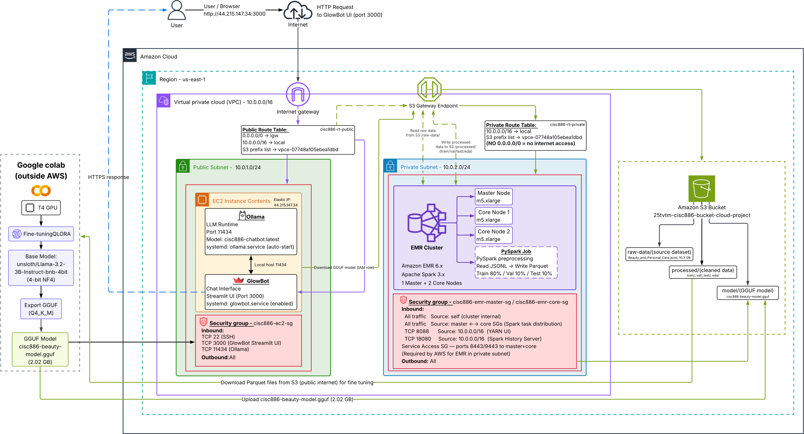

# 💄 GlowBot — Cloud-Based Beauty AI Chatbot

> **CISC 886 — Cloud Computing · Queen's University · School of Computing**
> End-to-end cloud LLM chatbot fine-tuned on 23.9M Amazon Beauty & Personal Care reviews and deployed on AWS.

| | |
|---|---|
| **Course** | CISC 886 — Cloud Computing |
| **Instructor** | Dr. Anwar Hossain |
| **Team** | Hana Essam `25tvtm` · Mariam Mousa `25qns4` · Alaa Mahmoud `25lskh` |
| **Region** | `us-east-1` |
| **Resource prefix** | `cisc886-` |

---

## 📋 Table of Contents

- [Overview](#overview)
- [System Architecture](#system-architecture)
- [Repository Structure](#repository-structure)
- [Prerequisites](#prerequisites)
- [Deployment Guide](#deployment-guide)
  - [Phase 1 — Terraform Infrastructure](#phase-1--terraform-infrastructure)
  - [Phase 2 — Upload Dataset to S3](#phase-2--upload-dataset-to-s3)
  - [Phase 3 — EMR Preprocessing](#phase-3--emr-preprocessing)
  - [Phase 4 — Fine-Tuning on Google Colab](#phase-4--fine-tuning-on-google-colab)
  - [Phase 5 — EC2 Deployment (Ollama)](#phase-5--ec2-deployment-ollama)
  - [Phase 6 — GlowBot Web Interface](#phase-6--glowbot-web-interface)
- [AWS Cost Summary](#aws-cost-summary)
- [Key Design Decisions](#key-design-decisions)

---

## Overview

GlowBot is a domain-specific conversational AI assistant for beauty and personal care products, built on a real Amazon review dataset. The system implements a complete cloud ML pipeline from raw data ingestion through to a live browser chat interface.

```
Raw Reviews → S3 → EMR Spark job → Parquet → Google Colab T4 (QLoRA fine-tuning)
                                                      ↓
                                             GGUF model → S3
                                                      ↓
                                         EC2 (Ollama inference server)
                                                      ↓
                                     GlowBot Streamlit UI (browser :3000)
```

---

## System Architecture

<!-- ============================================================
     ARCHITECTURE DIAGRAM
     Save your exported diagram as: docs/architecture/architecture_diagram.png
     Then this image tag will render automatically on GitHub.
     ============================================================ -->



> ⚠️ If the diagram above does not render, export from Lucidchart/draw.io and save to `docs/architecture/architecture_diagram.png`

### Infrastructure at a Glance

| Resource | Name | ID | Value |
|----------|------|----|-------|
| VPC | cisc886-vpc | `vpc-008eac38862d17196` | 10.0.0.0/16 |
| Public Subnet | cisc886-subnet-public | `subnet-04084490cb0e91338` | 10.0.1.0/24 — EC2 |
| Private Subnet | cisc886-subnet-private | `subnet-00a72654fc0ed5956` | 10.0.2.0/24 — EMR |
| Internet Gateway | cisc886-igw | `igw-0844f6de9575166d7` | Attached to VPC |
| S3 Endpoint | — | `vpce-07748a105ebea1dbd` | com.amazonaws.us-east-1.s3 |
| EC2 Instance | cisc886-ec2 | `i-04cc0c69d1b0ece84` | t3.large, AL2023, IP: 44.215.147.34 |
| S3 Bucket | 25tvtm-cisc886-bucket-cloud-project | — | Raw data, Parquet, GGUF model |
| EMR Cluster | cisc886-emr-cluster | `j-3T5G2DNG3L81V` | TERMINATED ✅ |

---

## Repository Structure

```
cisc886-cloud-project/
│
├── terraform/                              # All AWS infrastructure as code
│   ├── main.tf                             # Root — calls all submodules
│   ├── providers.tf                        # AWS provider + S3 remote state
│   ├── variables.tf                        # Input variable declarations
│   ├── outputs.tf                          # IPs, IDs, ARNs, SSH command
│   ├── terraform.tfvars.example            # Copy to terraform.tfvars and fill in
│   └── modules/
│       ├── vpc/main.tf                     # VPC, subnets, IGW, route tables, S3 endpoint
│       ├── ec2/main.tf                     # EC2, security group, IAM role, Elastic IP
│       ├── s3/main.tf                      # S3 bucket, versioning, encryption
│       └── emr/main.tf                     # EMR cluster, security groups
│
├── scripts/
│   ├── emr/
│   │   └── preprocess.py                  # PySpark pipeline: clean → format → split → Parquet
│   └── ec2/
│       ├── setup_ollama.sh                # Installs Ollama, downloads model, creates systemd service
│       └── setup_glowbot.sh               # Installs Streamlit, deploys GlowBot UI as systemd service
│
├── notebooks/
│   └── fine_tuning/
│       ├── 02_fine_tune_llama.ipynb       # QLoRA fine-tuning — runnable on Colab T4
│       ├── 03_test_model.ipynb            # Model test + base vs fine-tuned comparison
│       └── eda/
│           └── 01_data_exploration.ipynb  # EDA — generates 4 figures saved to S3
│
├── glowbot-app/
│   ├── app.py                             # GlowBot Streamlit chat interface (pink theme)
│   └── Modelfile                          # Ollama model configuration (template + parameters)
│
├── docs/
│   └── architecture/
│       └── architecture_diagram.png       # ← INSERT ARCHITECTURE DIAGRAM HERE
│
└── README.md
```

---

## Prerequisites

### Tools

| Tool | Version | Install |
|------|---------|---------|
| Terraform | ≥ 1.5 | https://developer.hashicorp.com/terraform/install |
| AWS CLI | ≥ 2.0 | https://docs.aws.amazon.com/cli/latest/userguide/install-cliv2.html |
| Python | ≥ 3.9 | https://www.python.org/downloads/ |
| Git | any | https://git-scm.com/ |
| Google Account | — | For Colab T4 GPU (fine-tuning) |

### AWS Setup

```bash
# Configure credentials
aws configure
# AWS Access Key ID: [your key]
# AWS Secret Access Key: [your secret]
# Default region: us-east-1
# Default output format: json

# Create EMR default roles (one-time, required by EMR)
aws emr create-default-roles
```

### Clone the Repo

```bash
git clone https://github.com/hanaessam/cisc886-cloud-project.git
cd cisc886-cloud-project
```

---

## Deployment Guide

### Phase 1 — Terraform Infrastructure

#### 1.1 — Configure variables

```bash
cd terraform
cp terraform.tfvars.example terraform.tfvars
```

Edit `terraform.tfvars`:

```hcl
prefix              = "cisc886"
aws_region          = "us-east-1"
ec2_key_name        = "cloud-project-key-pair"
my_ip               = "YOUR_PUBLIC_IP/32"        # find with: curl ifconfig.me
ec2_instance_type   = "t3.large"
s3_bucket_name      = "25tvtm-cisc886-bucket-cloud-project"
vpc_cidr            = "10.0.0.0/16"
public_subnet_cidr  = "10.0.1.0/24"
private_subnet_cidr = "10.0.2.0/24"
availability_zone   = "us-east-1a"
```

#### 1.2 — Deploy

```bash
terraform init
terraform plan      # review changes
terraform apply     # type 'yes'
```

Expected outputs:

```
ec2_instance_id        = "i-04cc0c69d1b0ece84"
ec2_public_ip          = "44.215.147.34"
emr_cluster_id         = "j-3T5G2DNG3L81V"
private_route_table_id = "rtb-0311161762976ee80"
private_subnet_id      = "subnet-00a72654fc0ed5956"
public_subnet_id       = "subnet-04084490cb0e91338"
s3_bucket_name         = "25tvtm-cisc886-bucket-cloud-project"
vpc_id                 = "vpc-008eac38862d17196"
ssh_command            = "ssh -i ~/.ssh/cloud-project-key-pair.pem ec2-user@44.215.147.34"
```

---

### Phase 2 — Upload Dataset to S3

```bash
# Dataset: Amazon Reviews 2023 — Beauty_and_Personal_Care
# Source: https://huggingface.co/datasets/McAuley-Lab/Amazon-Reviews-2023

# Upload raw data (~10.3 GB)
aws s3 cp Beauty_and_Personal_Care.jsonl \
  s3://25tvtm-cisc886-bucket-cloud-project/raw-data/Beauty_and_Personal_Care.jsonl

# Upload PySpark script
aws s3 cp scripts/emr/preprocess.py \
  s3://25tvtm-cisc886-bucket-cloud-project/scripts/preprocess.py

# Verify
aws s3 ls s3://25tvtm-cisc886-bucket-cloud-project/raw-data/
```

---

### Phase 3 — EMR Preprocessing

The cluster is launched by `terraform apply`. The PySpark step runs automatically.

#### Monitor and verify

```bash
# Check step status
aws emr list-steps --cluster-id j-3T5G2DNG3L81V --query "Steps[*].{Name:Name,State:Status.State}" --output table

# Verify output after completion (expect 101 = 100 parquet + _SUCCESS)
aws s3 ls s3://25tvtm-cisc886-bucket-cloud-project/processed/train/ | wc -l
aws s3 ls s3://25tvtm-cisc886-bucket-cloud-project/processed/val/   | wc -l
aws s3 ls s3://25tvtm-cisc886-bucket-cloud-project/processed/test/  | wc -l
```

#### ⚠️ Terminate cluster after job completes

```bash
aws emr terminate-clusters --cluster-ids j-3T5G2DNG3L81V

# Confirm
aws emr describe-cluster --cluster-id j-3T5G2DNG3L81V \
  --query "Cluster.Status.State" --output text
# → TERMINATED
```

**PySpark pipeline summary** (`scripts/emr/preprocess.py`):

| Step | Operation |
|------|-----------|
| 1 | Read `Beauty_and_Personal_Care.jsonl` from S3 |
| 2 | Select columns: `asin`, `rating`, `text`, `title`, `user_id` (2023 column names) |
| 3 | Filter: remove nulls, `len(text) >= 50`, rating in 1.0–5.0 |
| 4 | Format each row as Llama 3 chat template prompt/response pair |
| 5 | `randomSplit([0.80, 0.10, 0.10], seed=42)` |
| 6 | Write Parquet to `processed/train/`, `processed/val/`, `processed/test/` |

---

### Phase 4 — Fine-Tuning on Google Colab

1. Open `notebooks/fine_tuning/02_fine_tune_llama.ipynb` in Google Colab
2. **Runtime → Change runtime type → T4 GPU**
3. Run all cells in order (~40 minutes)

**Key hyperparameters:**

| Parameter | Value |
|-----------|-------|
| Base model | `unsloth/Llama-3.2-3B-Instruct-bnb-4bit` |
| Technique | QLoRA — r=16, alpha=16, dropout=0 |
| Target modules | q, k, v, o, gate, up, down projections |
| Trainable params | 24,313,856 (0.75% of 3.2B) |
| Train samples | 50,000 |
| Max steps | 200 |
| Learning rate | 2e-4 |
| Batch size | 2 (effective: 8 with grad accum=4) |
| Precision | fp16 |

**Training results:**

| Step | Train Loss | Val Loss |
|------|-----------|----------|
| 50   | 1.8809    | 1.8372   |
| 100  | 1.7820    | 1.7268   |
| 150  | 1.6370    | 1.5845   |
| 200  | 1.6359    | 1.5801   |

The final notebook cell exports to GGUF and uploads automatically to S3:
```
s3://25tvtm-cisc886-bucket-cloud-project/model/cisc886-beauty-model.gguf  (2.02 GB)
```

---

### Phase 5 — EC2 Deployment (Ollama)

```bash
# SSH into EC2
ssh -i ~/.ssh/cloud-project-key-pair.pem ec2-user@44.215.147.34

# Clone repo
git clone https://github.com/hanaessam/cisc886-cloud-project.git

# Run the setup script (documented in scripts/ec2/setup_ollama.sh)
chmod +x cisc886-cloud-project/scripts/ec2/setup_ollama.sh
./cisc886-cloud-project/scripts/ec2/setup_ollama.sh
```

The script:
1. Installs `zstd` (required by Ollama on AL2023)
2. Installs Ollama
3. Downloads `cisc886-beauty-model.gguf` from S3 via IAM role
4. Creates the `Modelfile` (Llama 3 chat template + system prompt)
5. Registers `cisc886-chatbot` in Ollama
6. Enables `ollama.service` in systemd (auto-start on reboot)

**Verify:**
```bash
ollama list
# cisc886-chatbot:latest  08551e8f3513  2.0 GB

curl http://localhost:11434/api/generate \
  -d '{"model":"cisc886-chatbot","prompt":"Recommend a moisturizer for dry skin.","stream":false}' \
  | python3 -c "import sys,json; print(json.load(sys.stdin)['response'])"
```

---

### Phase 6 — GlowBot Web Interface

```bash
# Still on EC2 — run the GlowBot setup script
chmod +x cisc886-cloud-project/scripts/ec2/setup_glowbot.sh
./cisc886-cloud-project/scripts/ec2/setup_glowbot.sh
```

The script:
1. Installs pip for Python 3.9 (version-specific URL required on AL2023)
2. Installs Streamlit
3. Pulls latest `glowbot-app/app.py` from GitHub
4. Enables `glowbot.service` in systemd (auto-start on reboot, depends on Ollama)

**Access GlowBot:** http://44.215.147.34:3000

**Useful commands:**
```bash
sudo systemctl status glowbot          # check status
sudo systemctl status ollama           # check Ollama
sudo journalctl -u glowbot -f          # live logs
sudo systemctl restart glowbot         # restart after code changes
```

---

## AWS Cost Summary

| Service | Usage | Approximate Cost |
|---------|-------|-----------------|
| EC2 t3.large | ~10 hours total runtime | $0.42 |
| S3 Storage | ~27 GB (raw JSONL + Parquet + GGUF) | $0.65 |
| S3 Requests | Spark reads + model download | $0.08 |
| EMR (3 × m5.xlarge) | ~2 hours (terminated after job) | $1.80 |
| Internet Gateway | Data transfer out | $0.10 |
| VPC / Subnets | No hourly charge | $0.00 |
| **S3 Gateway Endpoint** | **Free — no NAT Gateway used** | **$0.00** |
| Google Colab T4 | ~40 min fine-tuning (free tier) | $0.00 |
| **Total** | | **~$3.05** |

> **Key saving:** S3 Gateway Endpoint (`vpce-07748a105ebea1dbd`) routes all EMR→S3 traffic within AWS's internal network. A NAT Gateway would have added ~$32/month — avoided entirely.

---

## Key Design Decisions

| Decision | Reasoning |
|----------|-----------|
| **Amazon Linux 2023** instead of AL2 | Ollama requires GLIBC ≥ 2.27. AL2 ships GLIBC 2.26; AL2023 ships 2.34 |
| **Standard HuggingFace Trainer** instead of SFTTrainer | SFTTrainer triggers Unsloth's fused loss which crashes with `TorchRuntimeError` on torch 2.10 |
| **S3 Gateway Endpoint** instead of NAT Gateway | Gateway Endpoint is free; NAT Gateway costs ~$32/month baseline |
| **EMR in private subnet** | EMR only needs S3 access — no internet exposure needed, reduces attack surface |
| **Llama 3.2 3B** | 3.2B params at 4-bit NF4 = ~2.29 GB VRAM — fits T4 (15.6 GB), enables free Colab fine-tuning |
| **Streaming responses** | `st.write_stream()` + `stream=True` in Ollama makes ~163s CPU inference feel interactive |
| **Systemd for both services** | `Restart=always` + `WantedBy=multi-user.target` ensures auto-start on EC2 reboot |

---

*CISC 886 — Cloud Computing · Queen's University*
*Hana Essam `25tvtm` · Mariam Mousa `25qns4` · Alaa Mahmoud `25lskh`*